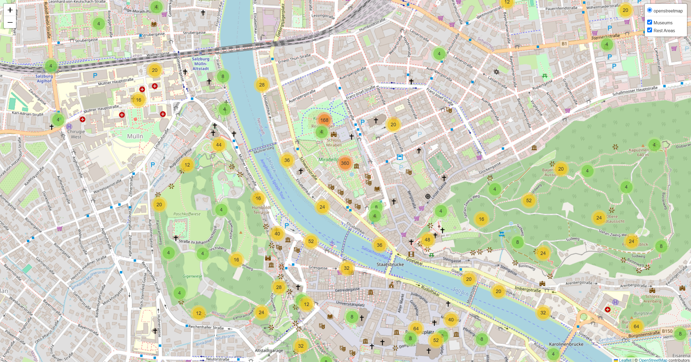

# Museums and Rest Areas in Salzburg: An Interactive Web Map with Folium

An interactive web map of museums and rest areas (benches and picnic tables) in the city of Salzburg,
built in Python from OpenStreetMap data.



## What it does

- Downloads OpenStreetMap features for Salzburg with OSMnx:
  museums (`tourism=museum`) and rest areas (`amenity=bench`, `leisure=picnic_table`)
- Displays them on a Folium (Leaflet.js) web map with an OpenStreetMap basemap
- Groups dense points with MarkerCluster so the map stays readable at every zoom level. The coloured circles are clusters, and the number shows how many points they contain (green: under 10, yellow: 10-99, orange: 100+). Zoom in to see individual markers: purple for museums, green for rest areas.
- Puts museums and rest areas on separate layers that can be switched on and off

The map was a first step towards my final course project, a route optimizer between Salzburg museums
([A4_Software_Development](https://github.com/dmter/A4_Software_Development)).

## Run it

```bash
conda env create -f environment.yaml
conda activate a3_env
jupyter notebook A3_Folium_Salzburg.ipynb
```

## Tools

Python 3.10 · Folium · OSMnx · GeoPandas · Shapely · pandas · Matplotlib

## Context

Assignment for the Software Development course, Copernicus Master in Digital Earth,
Paris Lodron University Salzburg, 2025.

Data © OpenStreetMap contributors (ODbL).
